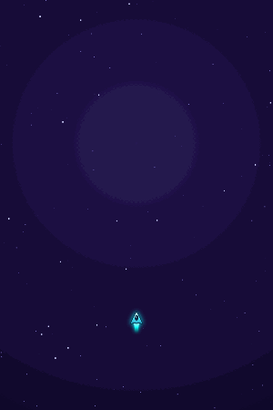
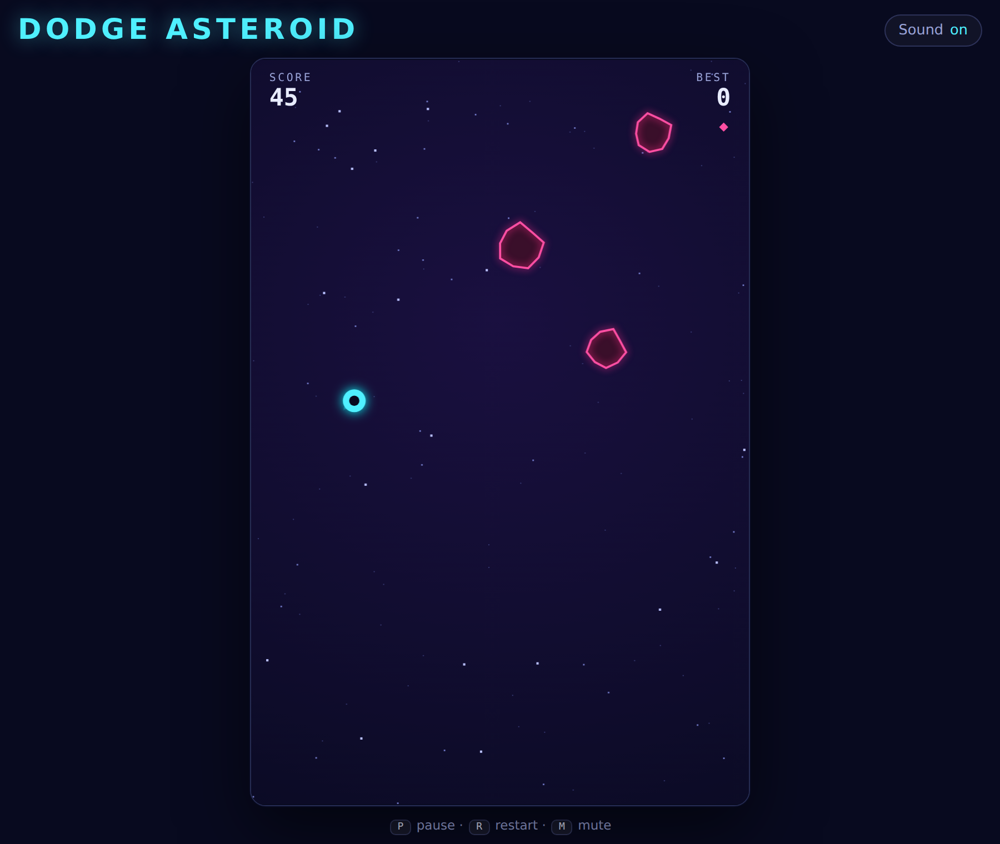
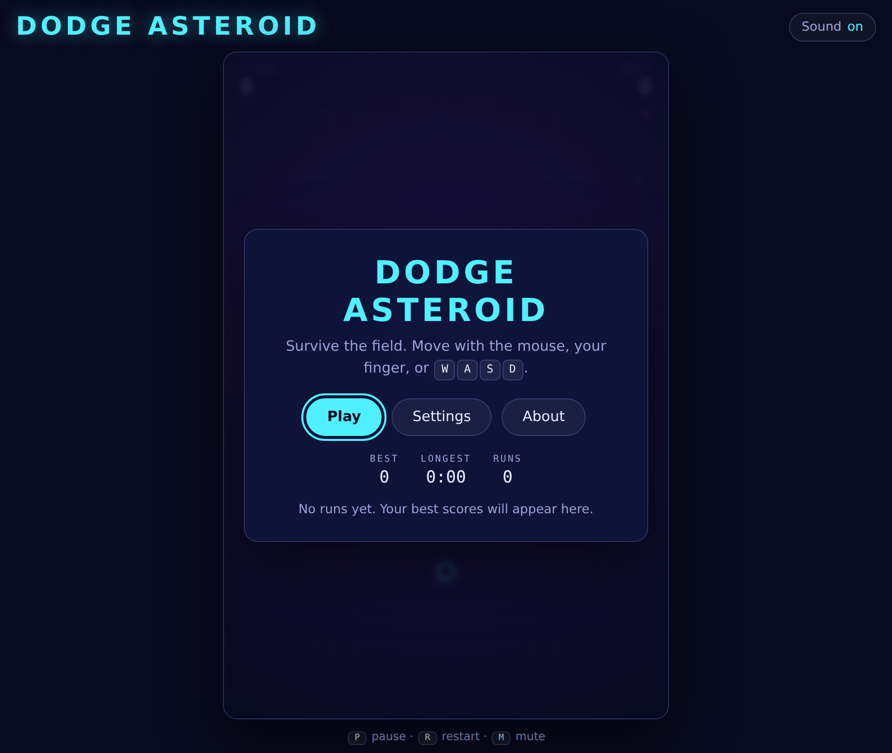
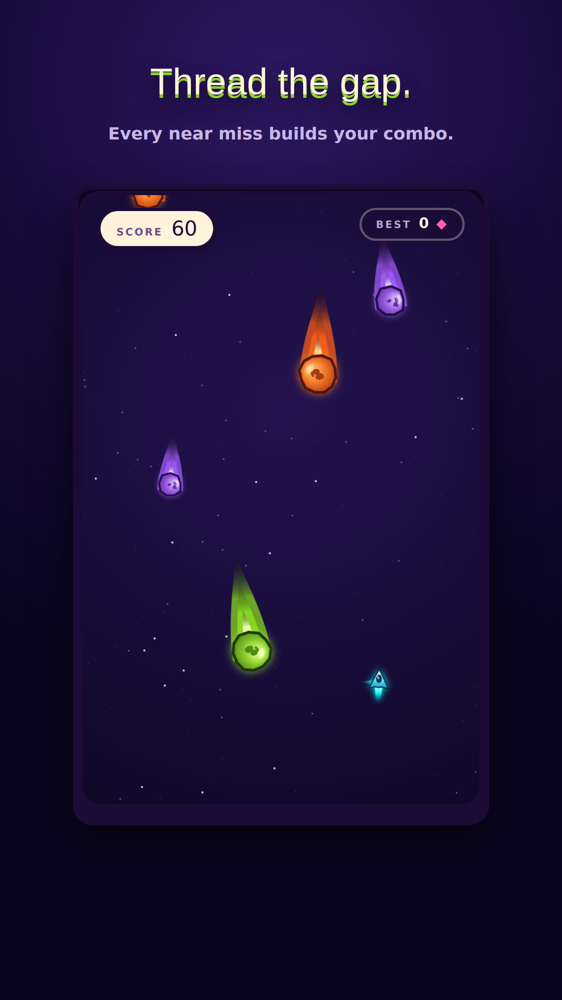
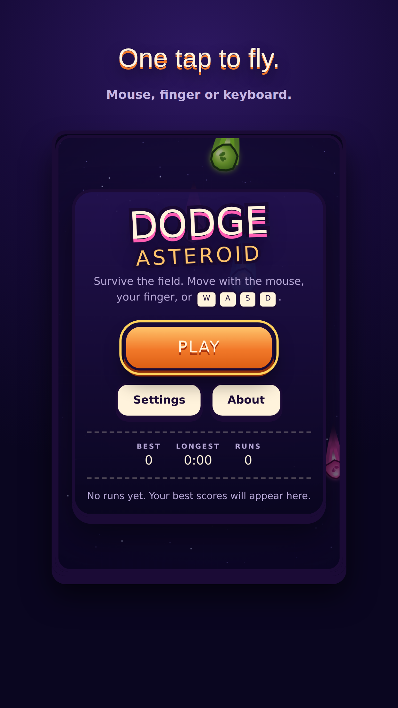
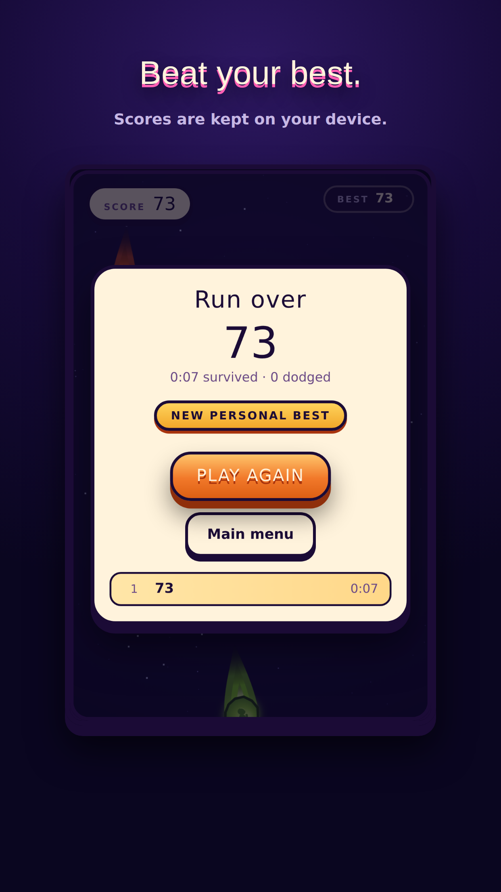
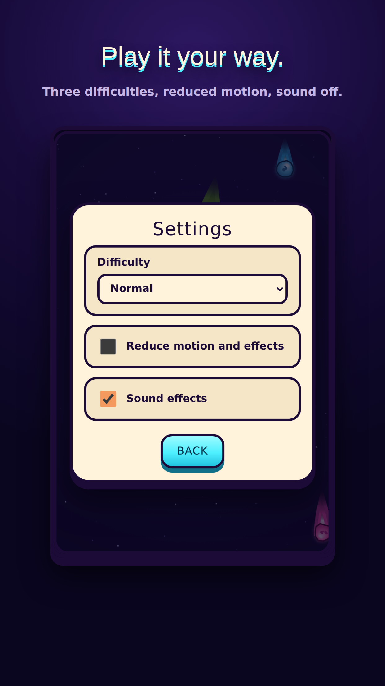

# Dodge Asteroid

[](https://github.com/Mattathiasa/Dodge-Asteroid/actions/workflows/ci.yml)

A neon arcade dodging game. Survive an asteroid field with the mouse, a finger,
or the keyboard — thread the gaps to build a combo multiplier, and grab pickups
before the field closes in.

**[▶ Play it](https://mattathiasa.github.io/Dodge-Asteroid/)** · TypeScript ·
Canvas 2D · zero runtime dependencies

<p align="center">
  
</p>

## What it does

- **Survival scoring with combos.** Points come from time survived and asteroids
  dodged. Passing close to a rock without touching it counts as a near miss and
  builds a multiplier that lapses if you play it safe.
- **Three pickups that do genuinely different things** — a timed shield bubble
  that vaporises what it touches, time dilation, and an extra life.
- **Plays anywhere.** Mouse, touch, arrow keys or WASD. Touch steers a point
  above your finger, because a fingertip covers the ship otherwise.
- **Installs as an app and plays offline.** A generated service worker precaches
  the whole shell, so once it has loaded it runs with no network at all.
- **Built for a phone, not just shrunk onto one.** In landscape the HUD moves
  into the space beside the field instead of being squeezed over it; the screen
  is kept awake during a run; impacts are felt through the vibration motor; and
  fullscreen is offered where the platform supports it.
- **Difficulty that plateaus** instead of running away.
- **Local leaderboard**, personal bests, and difficulty presets, saved between
  sessions.
- **Accessible by default:** menus are real focusable DOM controls, motion can
  be reduced, and score milestones are announced to screen readers.

<p align="center">
  
  
</p>

<p align="center">
  
  
  
  
</p>

## On a phone

The mobile build is not a scaled-down desktop page:

|                        |                                                                                                                                                                                                                                                                                                                                                     |
| ---------------------- | --------------------------------------------------------------------------------------------------------------------------------------------------------------------------------------------------------------------------------------------------------------------------------------------------------------------------------------------------- |
| **Installable**        | A web app manifest with maskable icons, plus the iOS-specific meta Safari still needs. Add it to a home screen and it launches standalone, with no browser chrome.                                                                                                                                                                                  |
| **Offline**            | `scripts/build-sw.mjs` reads the real `dist/` output after every build and generates a service worker around it, so the precache list can never drift from Vite's content-hashed filenames and a new build invalidates the old cache automatically. Google Fonts is cached at runtime, so an installed copy starts with the right typeface offline. |
| **Landscape**          | The HUD is a rail beside the field rather than an overlay on top of it. A landscape phone cannot show a 2:3 field and a full-width HUD at once, so the chrome uses the gutter the field cannot.                                                                                                                                                     |
| **Stays awake**        | A Screen Wake Lock is held for the duration of a run and released in menus — steering with a finger on a canvas registers no activity, so the phone would otherwise dim and lock mid-game.                                                                                                                                                          |
| **Feels physical**     | Short, distinct vibration patterns for a pickup, a shield break, a lost life and a crash. Off by a toggle, and absent entirely where the platform has no vibration motor.                                                                                                                                                                           |
| **No stray scrolling** | The viewport is locked and overscroll disabled, so a drag steers the ship instead of rubber-banding the page or triggering pull-to-refresh.                                                                                                                                                                                                         |

Every one of those degrades to nothing rather than breaking: a browser with no
service worker, no wake lock and no vibration still gets the whole game.

## How it is put together

The guiding rule is that everything interesting is a pure function, and the
browser is kept at the edges.

```
src/
  core/     seeded RNG, math, viewport geometry     — no DOM
  game/     simulation: phases, loop, collision,    — no DOM
            difficulty, spawning, scoring, movement
  render/   canvas drawing, starfield, screen shake
  input/    mouse, touch and keyboard -> one snapshot per frame
  audio/    sound effects synthesised at runtime
  ui/       HUD, overlays, leaderboard, announcements
  storage/  persistence that never throws
```

`core/` and `game/` never import from `render/`, `input/`, `audio/` or the DOM.
Three things follow from that:

**The simulation is reproducible.** Every random value comes from a seeded
generator, so a run is a pure function of its seed. A test can play sixty
seconds of game twice and assert the two runs are identical, which is how frame
rate independence is verified rather than assumed.

**Side effects are reported, not performed.** The simulation emits events —
`nearMiss`, `pickup`, `destroyed` — into a sink. The composition root drains
that sink and decides what is a sound, a screen shake or an announcement. Tests
assert on the events instead of on mocks.

**The loop is testable.** A fixed-timestep accumulator with an injectable clock
means physics runs in constant steps at any refresh rate, and the loop can be
stepped by hand in a unit test with no browser involved.

A few details that matter more than they sound:

- **Continuous collision detection.** Impact time is solved along the relative
  motion of the two circles rather than sampling positions, so a fast asteroid
  cannot pass through the ship between two steps.
- **The difficulty curve** is a `smoothstep` ramp with a hard speed cap: flat at
  the start, steepest in the middle, flat once it tops out.
- **Entities live in fixed-capacity pools**, so a long run does no per-frame
  allocation and never pauses for garbage collection mid-dodge.
- **The canvas backing store carries the world's own aspect ratio**, sized in
  device pixels, and its display size is fitted in JavaScript. That keeps it
  sharp on high-density displays, puts the pointer exactly on the ship, and
  means the frame is the play field on any screen shape — the pure-CSS version
  left dead bands on tall phones, because a percentage `max-height` does not
  resolve against an auto-height parent.

## Testing

The simulation is a pure function of its seed, its input and its timestep, and
that is what the tests cover: **159 unit tests** across the difficulty curve,
collision (including the tunnelling case), scoring, spawning, the state machine,
the loop, the object pool, persistence, and a sixty-second deterministic
simulation of a whole run.

Canvas draw calls and WebAudio graphs are deliberately not unit-tested —
asserting that `ctx.arc` was called twenty-two times is a test that only breaks
when the visuals improve. Those are covered by **Playwright specs that drive the
real built game** in Chromium and on an emulated phone: that the ship follows
the mouse and the keyboard, that pausing genuinely freezes the world, that a run
ends on an in-page screen, that the best score survives a reload, and that a tap
steers on a touch screen.

The mobile and offline behaviour is covered end to end rather than asserted in
prose: one spec installs the service worker, drops the network, reloads, and
plays a run with no connection; another checks the landscape HUD is fully on
screen and that nothing scrolls the page sideways.

```bash
npm run typecheck   # tsc --noEmit
npm run lint        # type-aware ESLint
npm test            # unit tests
npm run e2e         # Playwright, against a production build
npm run check       # typecheck + lint + test
```

## Running it

Requires Node 20 or newer.

```bash
npm ci
npm run dev       # http://localhost:5173
npm run build     # -> dist/
npm run preview   # serve the production build
```

`npm run build` produces about **31 KB of JavaScript, 11 KB gzipped**, with no
runtime dependencies and no binary assets — the ship, the asteroids, the
particles and every sound effect are generated at runtime.

To regenerate the media in this README:

```bash
npm run build && npm run preview -- --port 4173 --strictPort &
npm run media    # screenshots, the demo GIF, and the store cards
npm run decks    # the two slide decks in docs/decks/
```

## Decks

Two slide decks live in [`docs/decks/`](docs/decks), both generated from
[`scripts/`](scripts) so they stay in step with the code and the screenshots:

- **Case study** — the broken original, the rewrite decisions, the architecture
  and the measured results.
- **Design directions** — the three interface directions that were drafted, with
  the rationale and the tradeoff for each, and what shipped.

## About the rewrite

This started as a jQuery prototype, still in the history at
[`9390921`](https://github.com/Mattathiasa/Dodge-Asteroid/tree/9390921a5b79bbc6808cc6c210c71e2bd012eb55). It did
not really work, and the reasons are a decent tour of what this version is built
to avoid:

| The original                                                                                                                                                                   | Now                                                                 |
| ------------------------------------------------------------------------------------------------------------------------------------------------------------------------------ | ------------------------------------------------------------------- |
| `pauseGame` and `animateAsteroids` were called but never defined — the first aborted the remaining event bindings, the second left Resume permanently broken                   | One state machine with a pure transition function, covered by tests |
| `isColliding()` ended in a bare `return`, so it always read as false and `gameOver()` was unreachable; game over was a blocking `alert()` fired from inside the collision test | Continuous collision detection; game over is an in-page screen      |
| A `setInterval` was created for every asteroid and never cleared                                                                                                               | One fixed-timestep loop                                             |
| Fall speed compounded on every spawn with no bound — unplayable in about thirty seconds                                                                                        | A bounded curve that eases in and plateaus                          |
| The ship rendered a full body-width away from the cursor                                                                                                                       | One tested coordinate mapping                                       |
| Mouse only, with no viewport meta tag, so it could not be played on a phone                                                                                                    | Mouse, touch and keyboard                                           |
| 86 KB of vendored jQuery carrying three CVEs                                                                                                                                   | No runtime dependencies                                             |
| No tests, no CI, no licence                                                                                                                                                    | 159 unit tests, 18 e2e specs, CI on every push                      |

## Licence

MIT — see [LICENSE](LICENSE).

Built by [Mattathias Abraham](https://github.com/Mattathiasa).
